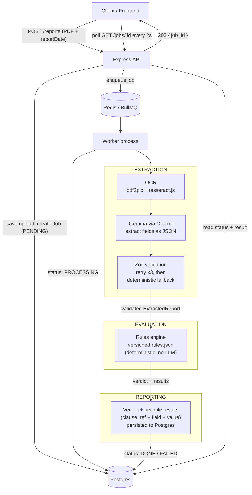

# Property Valuation Compliance Checker

Turns a scanned property valuation report (PDF) into a structured object,
evaluates it against a versioned bank guideline rule set, and produces an
auditable compliance verdict where **every flag traces back to the exact
source field and guideline clause that produced it**. Upload a report,
watch it move through OCR and extraction, and get back not just a
COMPLIANT/NON_COMPLIANT/NEEDS_REVIEW verdict but the full paper trail
behind it — which is the actual point of a compliance tool: not just an
answer, but a defensible one.

## Architecture



The three concerns are kept strictly separate in the code, not just on
this diagram: **extraction** (`src/extraction/`) only ever produces data,
**evaluation** (`src/evaluation/`) only ever runs deterministic checks
against that data, and **reporting** (`src/reporting/`) only ever stores
and serves what evaluation produced. The LLM lives entirely inside
extraction — it never sees a rule and never makes a compliance decision.

## Design decisions

**The LLM is treated as an untrusted external dependency, not a source of
truth.** Its raw output is parsed as JSON and validated against a Zod
schema before a single field is trusted; a parse or validation failure
triggers a retry (up to 3 attempts, short backoff), and repeated failure
falls back to a deterministic regex parser for a few critical fields —
with everything from that fallback path flagged `needs_review`. *Why:* an
LLM will occasionally return malformed or wrong-shaped output, and a
compliance tool can't silently propagate that.

**Compliance is decided only by a deterministic rules engine — never the
LLM.** The LLM's job ends at producing structured data; every PASS/FAIL/
NEEDS_REVIEW verdict comes from plain, testable check functions
(`in_range`, `in_blocklist`, `max_age_days`, etc.) run against that data.
*Why:* auditability. An interviewer (or a real auditor) can point at any
flag and trace it to an exact function and an exact input, with nothing
probabilistic in between.

**Rules are versioned JSON data, not code.** Adding or changing a rule
means editing `rules.json`, not touching the engine. Each rule is `{ id,
description, severity, effective_from, field, check, params, clause_ref
}`, validated against a Zod schema (a discriminated union, so a rule's
`params` shape is checked against whichever `check` it declares). *Why:*
the guideline changes over time and rules need versioning
(`effective_from` + date-based selection) without code changes or
redeploys.

**Processing is asynchronous.** `POST /reports` returns a `job_id`
immediately; OCR + an LLM call are too slow for a synchronous HTTP
response. A BullMQ/Redis queue hands the job to a separate worker process,
and the client polls `GET /jobs/:id` until it's done. *Why:* a multi-second
(sometimes multi-minute) pipeline behind a single HTTP request would mean
timeouts, retries-on-the-wrong-layer, and a bad user experience.

**Idempotency via file hash.** The uploaded PDF is SHA-256 hashed before a
job is created; if that hash already has a job, the existing job is
returned instead of re-running OCR + LLM extraction. *Why:* OCR + LLM
calls are the expensive part of this pipeline — no reason to redo them for
a file that's already been processed.

**Storage is hidden behind one small module.** `src/reporting/jobStore.ts`
exposes `createJob` / `updateJobStatus` / `getJob` / `findJobByFileHash` /
`saveResult` / `getResult` — nothing else in the codebase knows or cares
how jobs are actually stored. It started as an in-memory `Map` (session 4)
and was later swapped for Postgres + Prisma (session 6) by rewriting only
that one file; every caller just needed `await` added, since the calls
became asynchronous. *Why:* storage backends change; call sites shouldn't
have to.

## Coverage

Every clause-level condition examined from the real guideline document,
classified as it was actually resolved — not aspirationally. **67
conditions examined: 49 automated rules, 13 flagged for manual review, 4
excluded as too subjective to encode, 1 not a compliance rule at all.**

Legend: **AUTOMATED_RULE** — implemented in `rules.json`, runs
automatically. **MANUAL_REVIEW** — objectively defined, but needs a human
to verify a document/fact the report itself won't contain. **EXCLUDED_
SUBJECTIVE** — the guideline itself never defines a checkable threshold.

### Vacant Land / General Valuation Norms (Clause B, H.I)

| Clause | Condition | Classification | Rule / Note |
|---|---|---|---|
| B | Vacant land area 800–10,000 sqft | AUTOMATED_RULE | `VACANT_LAND_AREA_RANGE` |
| B | Land contributes ≤50% of total collateral value | EXCLUDED_SUBJECTIVE | Never confirmed this is data a single valuation report contains (likely a loan/collateral-package-level fact); field names never established |
| H.I.1 | Technical report valid 180 days | AUTOMATED_RULE | `TECHNICAL_REPORT_VALIDITY` (measured as-of the approval date) |
| H.I.5 | Commercial property min. 100 sqft BUA | AUTOMATED_RULE | `COMMERCIAL_MIN_BUA` |
| H.9 | Property age > 5 years (building value, no sanctioned plan) | AUTOMATED_RULE | `BUILDING_VALUE_NO_SANCTIONED_PLAN_AGE_GATE` — only the age sub-condition; H.9 says "among the conditions," implying others exist that weren't given to us |
| H.10 | Residential/commercial: 1 vs 2 valuations by value | EXCLUDED_SUBJECTIVE | Needs a check type never built; "number of valuations performed" may be case-level data, not report-level |
| H.10 | Other property: 2 valuations by city-tier value | EXCLUDED_SUBJECTIVE | Same as above, plus the source text's condition (iii) reads inconsistently with (i)/(ii) and was never clarified |
| H.11 | Lower of two valuations is used | Not a rule | Data-derivation instruction for extraction/normalization, not a compliance check |
| H.I (area verification) | Measured vs. documented carpet area | AUTOMATED_RULE | `CARPET_AREA_MEASURED_VS_DOCUMENTED` — data-integrity check, reports NEEDS_REVIEW (not FAIL) on mismatch |

### Category B — hard block, HIGH (Clause G)

| Clause | Condition | Classification | Rule |
|---|---|---|---|
| G.1 | Govt. land acquisition pending/announced | AUTOMATED_RULE | `CATEGORY_B_LAND_ACQUISITION_PENDING` |
| G.2 | Outside India | AUTOMATED_RULE | `CATEGORY_B_OUTSIDE_INDIA` |
| G.3 | Chawl / Gaothan / Pagdi | AUTOMATED_RULE | `CATEGORY_B_CHAWL_GAOTHAN_PAGDI` |
| G.4 | Stone crushers | AUTOMATED_RULE | `CATEGORY_B_STONE_CRUSHER` |
| G.5 | Old age homes / orphanages | AUTOMATED_RULE | `CATEGORY_B_OLD_AGE_HOME_ORPHANAGE` |
| G.6 | Lal Dora | AUTOMATED_RULE | `CATEGORY_B_LAL_DORA` |
| G.7 | Title deeds pending with registrar | AUTOMATED_RULE | `CATEGORY_B_TITLE_DEED_PENDING` |
| G.8 | Religious monuments/constructions | AUTOMATED_RULE | `CATEGORY_B_RELIGIOUS_MONUMENT` |
| G.9 | Grama Natham (except Tamil Nadu) | AUTOMATED_RULE | `CATEGORY_B_GRAMA_NATHAM` — state-based exception via a compound (AND) applicability condition |
| G.10 | Hazardous industries | AUTOMATED_RULE | `CATEGORY_B_HAZARDOUS_INDUSTRY` |
| G.11 | Land locked | AUTOMATED_RULE | `CATEGORY_B_LAND_LOCKED` |
| G.12 | Buffer zone | AUTOMATED_RULE | `CATEGORY_B_BUFFER_ZONE` |
| G.13 | Forest land — reserve forest | AUTOMATED_RULE | `CATEGORY_B_RESERVE_FOREST` |
| G.14 | Minors / charitable trust **without proper permission** | MANUAL_REVIEW | "Without proper permission" requires verifying a document, not report data |
| G.15 | Hilly/flood/mining/quarry/wet-agri **without proper approvals** | MANUAL_REVIEW | Same reasoning as G.14 |
| G.16 | Agricultural land / farmhouse / farmland | AUTOMATED_RULE | `CATEGORY_B_AGRICULTURAL_FARMLAND` |
| G.17 | Built on agricultural land | AUTOMATED_RULE | `CATEGORY_B_BUILT_ON_AGRI_LAND` |
| G.18 | Amalgamated property, overlapping structure | AUTOMATED_RULE | `CATEGORY_B_AMALGAMATED_OVERLAPPING` — shares a field with F.18; see note below |

### Category A — needs one-level-higher NFA, MEDIUM (Clause F)

| Clause | Condition | Classification | Rule |
|---|---|---|---|
| F.1 | Under construction | AUTOMATED_RULE | `CATEGORY_A_UNDER_CONSTRUCTION` — base flag only; the "positive ICICI site-visit confirmation" exception is applied manually |
| F.2 | Construction ≥85% approvable by sanctioning authority | AUTOMATED_RULE | `CONSTRUCTION_COMPLETION_GATE` — kept independent from F.1 (relationship between the two was never confirmed) |
| F.3 | HUF ownership | AUTOMATED_RULE | `CATEGORY_A_HUF_OWNERSHIP` |
| F.4 | Industrial land | AUTOMATED_RULE | `CATEGORY_A_INDUSTRIAL_LAND` |
| F.5 | Guest house | AUTOMATED_RULE | `CATEGORY_A_GUEST_HOUSE` — base flag only; company-owned/employee-use exception applied manually |
| F.6 | Cinema halls | AUTOMATED_RULE | `CATEGORY_A_CINEMA_HALL` |
| F.7 | Petrol pumps | AUTOMATED_RULE | `CATEGORY_A_PETROL_PUMP` |
| F.8 | Vacant industrial property | AUTOMATED_RULE | `CATEGORY_A_VACANT_INDUSTRIAL` |
| F.9 | Rented industrial property | AUTOMATED_RULE | `CATEGORY_A_RENTED_INDUSTRIAL` |
| F.10 | Cold storage | AUTOMATED_RULE | `CATEGORY_A_COLD_STORAGE` |
| F.11 | Hostel | AUTOMATED_RULE | `CATEGORY_A_HOSTEL` |
| F.12 | Office/shop in mall structure | AUTOMATED_RULE | `CATEGORY_A_MALL_OFFICE_SHOP` |
| F.13 | IT park / SEZ | AUTOMATED_RULE | `CATEGORY_A_IT_PARK_SEZ` |
| F.14 | Commercial complex, >3 rented/leased shops | AUTOMATED_RULE | `CATEGORY_A_COMMERCIAL_SHOP_COUNT` — assumes shop count is extractable; degrades to NEEDS_REVIEW if not |
| F.15 | Multi-tenanted residential, >3 tenants | AUTOMATED_RULE | `CATEGORY_A_MULTI_TENANTED_RESIDENTIAL` — same caveat as F.14 |
| F.16 | Leased to large corporate / MNC retail / financial institution | EXCLUDED_SUBJECTIVE | "Large" is never defined in the source text |
| F.17 | Undivided share ownership, no demarcation | AUTOMATED_RULE | `CATEGORY_A_UNDIVIDED_SHARE_NO_DEMARCATION` — same extractability caveat as F.14 |
| F.18 | Amalgamated property, non-overlapping structure | AUTOMATED_RULE | `CATEGORY_A_AMALGAMATED_NON_OVERLAPPING` — see note below |
| F.19 | Godown | AUTOMATED_RULE | `CATEGORY_A_GODOWN` |

> **Known limitation (G.18 / F.18):** both rules key off one boolean field
> (`is_amalgamated_overlapping`). A normal, non-amalgamated property has
> that field as `null`, which both rules report as `NEEDS_REVIEW` rather
> than "not applicable." Cosmetic noise, not a correctness bug — a reviewer
> sees at a glance the field doesn't apply.

### Special-purpose properties (Marriage garden, Mandi, road width, Ludhiana, wet-land)

| Clause | Condition | Classification | Rule |
|---|---|---|---|
| C.3 / Annexure I.E.7 | Marriage garden: constructed area ≥20% of land | AUTOMATED_RULE | `MARRIAGE_GARDEN_MIN_CONSTRUCTED_COVERAGE` |
| Annexure I.E | Wet-land residential: min. 15 years age | AUTOMATED_RULE | `WETLAND_RESIDENTIAL_MIN_AGE` |
| Annexure I.E | Wet-land residential: ≥50% built coverage | AUTOMATED_RULE | `WETLAND_RESIDENTIAL_MIN_BUILT_COVERAGE` |
| Annexure I.E | Wet-land: within Municipal Corp/Development Authority area | MANUAL_REVIEW | Verifiable fact, not report data |
| Annexure I.E | Wet-land: surroundings not used for agriculture | MANUAL_REVIEW | Inherently requires a site visit / judgment |
| Annexure I.E | Wet-land: SARFAESI confirmation | MANUAL_REVIEW | External legal/process confirmation |
| Annexure I.C | Mandi: ≥50 registered shops | AUTOMATED_RULE | `MANDI_MIN_REGISTERED_SHOPS` |
| Annexure I.C | Mandi: ≥75% occupancy | AUTOMATED_RULE | `MANDI_MIN_OCCUPANCY_PCT` |
| Annexure I.C | Mandi: ≥10 years residual lease | AUTOMATED_RULE | `MANDI_MIN_RESIDUAL_LEASE_YEARS` |
| Annexure I.C | Mandi: lease deed verified | MANUAL_REVIEW | Document verification |
| Annexure I.C | Mandi: NOC obtained | MANUAL_REVIEW | Document verification |
| Annexure I.C | Mandi: APMC registration | MANUAL_REVIEW | Document verification |
| Annexure I.E.1 | Independent house (≤G+2): road ≥10 feet | AUTOMATED_RULE | `PANCHAYAT_HOUSE_MIN_ROAD_WIDTH` |
| Annexure I.E.2 | Apartment: road ≥20 feet | AUTOMATED_RULE | `PANCHAYAT_APARTMENT_MIN_ROAD_WIDTH` — "20 feet" has no explicit "minimum" qualifier in the source text; implemented as a minimum for consistency with the house clause. The I.E.1/I.E.2 mapping to house/apartment is an inferred ordering, not stated explicitly. |
| Annexure I.E.6/E.7 | Warehouse / marriage garden / convention centre: road ≥30 feet | AUTOMATED_RULE | `WAREHOUSE_MARRIAGE_GARDEN_MIN_ROAD_WIDTH` |
| Annexure I.E (Ludhiana) | Commercial/industrial/residential: ≥13 years ownership | AUTOMATED_RULE | `LUDHIANA_MIN_OWNERSHIP_YEARS` |
| Annexure I.E (Ludhiana) | Non-polluting confirmation | MANUAL_REVIEW | Document verification |
| Annexure I.E (Ludhiana) | Tax receipt | MANUAL_REVIEW | Document verification |
| Annexure I.E (Ludhiana) | Self-occupied confirmation | MANUAL_REVIEW | Document verification |

## How to run

**Prerequisites:** Node 22+, Docker (with Compose), and
[Ollama](https://ollama.com) installed on the host.

### 1. Start Ollama (on the host, not in Docker)

Ollama needs GPU/host resources Docker can't easily provide here, so it
runs outside the container stack:

```
ollama pull gemma
ollama serve
```

The app looks for Ollama at `http://localhost:11434` by default —
override with the `OLLAMA_URL` environment variable if yours runs
elsewhere. `docker compose` already points the containers at
`http://host.docker.internal:11434` for you.

### 2. Bring up the backend

```
docker compose up
```

Starts Postgres, Redis, runs the database migration once, and starts both
the API (port 3000) and the worker.

### 3. Run the frontend (optional, separate terminal)

```
cd frontend
cp .env.local.example .env.local
npm install
npm run dev
```

Open `http://localhost:3001`, upload a PDF, pick a report date, and watch
it process.

### The two commands that prove it works

```
docker compose up   # brings up the whole backend stack from nothing
npm test              # 157 tests, all passing, no external services needed
```

## Testing

- **Unit tests** cover every check function (`in_range`, `in_blocklist`,
  `max_age_days`, `ratio_in_range`, `not_equals`, `fields_match_within_
  tolerance`, `threshold_by_city_tier`), the rule schema, rule-set version
  selection, the verdict rollup, the extraction schema, the fallback
  parser, and the job store.
- **Failure paths are tested by mocking the LLM boundary** — the Gemma
  HTTP call is mocked to return malformed JSON, JSON that fails schema
  validation, and repeated failures, asserting the retry-then-fallback
  path is actually taken each time. No real Ollama call happens in any
  test.
- **Integration tests** cover the full `processReport` pipeline (OCR →
  extract → evaluate) and the API routes, with OCR/Gemma/Prisma/BullMQ all
  mocked at their boundaries — no real PDF, Postgres, Redis, or Ollama is
  needed to run the suite.
- **CI** (`.github/workflows/test.yml`) runs the full test suite on every
  push, using nothing but `npm ci` + the mocked test suite — no services
  to provision.

## Known gaps

- **The Postgres migration was hand-written**, not generated by
  `prisma migrate dev` (no live database was available while building
  it). It follows Prisma's standard conventions for this schema, but
  `docker compose up`'s `migrate` step is the first real test of it against
  an actual database.
- **OCR has no automated test against a real scanned PDF.** Its logic is
  built and typechecked, but only the reliability wrapper around the LLM
  call is unit-tested with mocks, per the design decision not to require a
  real PDF for the test suite.
- **The frontend has not been exercised against a live backend end to
  end** — it builds, typechecks, lints clean, and both routes render
  correctly, but the full upload → poll → verdict flow hasn't been
  clicked through in a browser against a running `docker compose up`
  stack.
